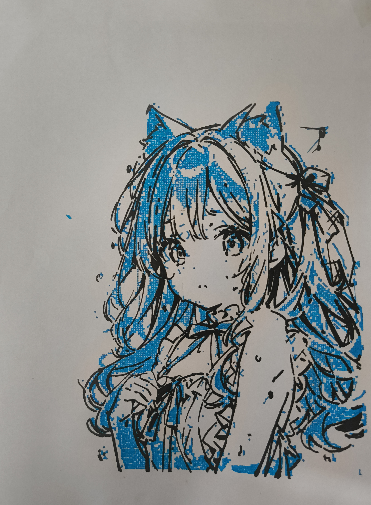

# Image manipulator tool

This tool has a python script that reads any input image (given sample is AI generated)
And splits it into multiple layers based on the input n_colors parameter provided by selecting the dominant colors from the input image.
The splitted layers consist of the following :

* An outline layer
* A layer containing the darkest parts for black fill
* And n_colors layers containing dots of the dominant colors.

## Installation

1. Clone this repository:
2. run `python -m pip install -r requirements.txt`

## Usage

Run the script with the following command:

python image_splitter.py path/to/your/image.png --n_colors N

- `path/to/your/image.png`: Path to the input image file (required)
- `--n_colors N`: Number of dominant colors to extract (optional, default is 5)

## Example:

python image_splitter.py otherFiles/input_image.png --n_colors 3

Sample Output from above script attached in **images/** folder

## SVG Conversion

These layers can then be imported into inkscape to convert them into SVG by using the trace bitmap function.

`Path > Trace Bitmap`

Below are the inkscape settings used and corresponding output:

output form this step attached in `otherfiles/blackOutline.svg`

## PrusaSlicer Settings

Settings from my current prusaslicer profile used for drawing without extrusion and heating
are exported into file : `otherFiles/config.ini`

Import into prusaslicer for convinience by opening prusa slicer and navigating to
 `Menu > File > Import > Import Config... `

Select the config.ini file attached for drawlr profile.
After this the svg file can be drag and droped into prusaslicer

The generated GCode files after a bit of modifcations for changing pen behaviour at start layer is attached in : 

`otherFiles/dots.gcode`

`otherFiles/outlineBlack.gcode`

Printer used : Ender 3 Neo

Note : Best results with "Brush Pens" with soft tip bristles which can provide additional texture by providing different line width on different pressures.
Final Plot :

